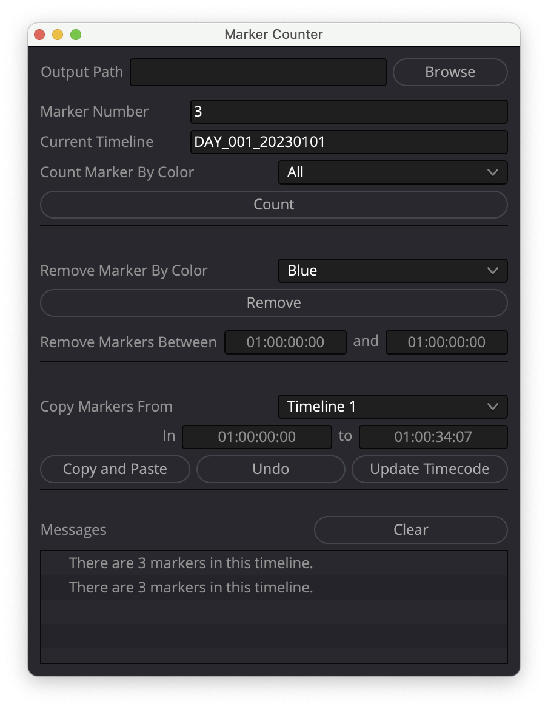
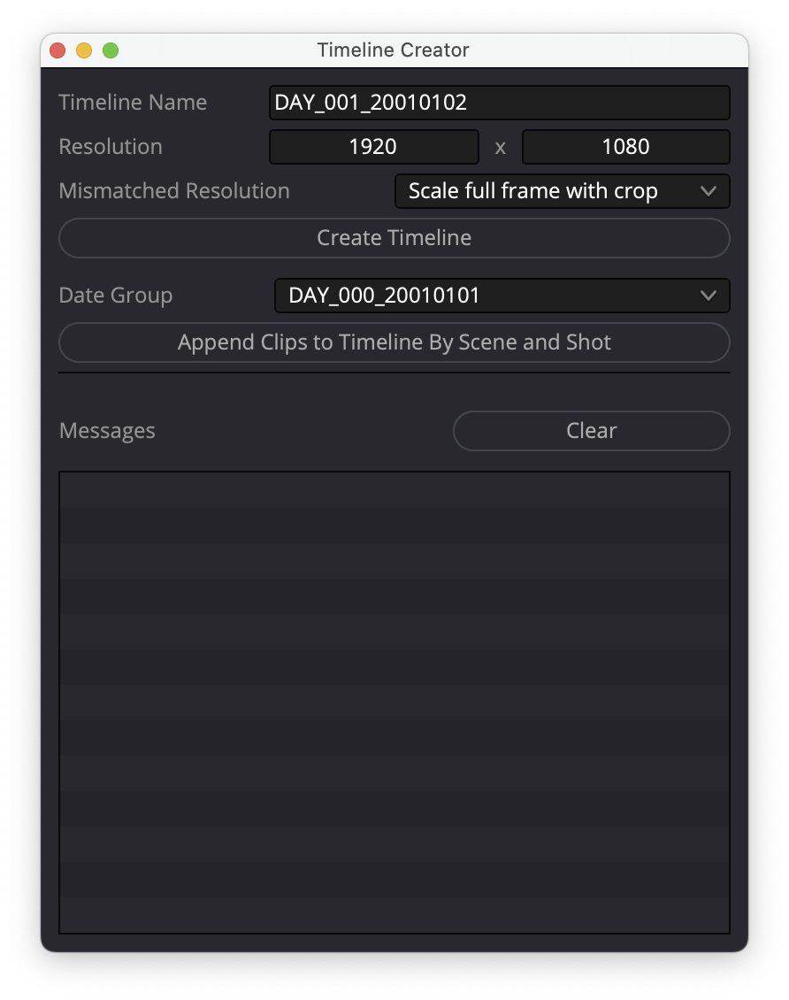

  
  

# Usage

Copy all files under `src` directory to this path `/Library/Application
Support/Blackmagic Design/DaVinci Resolve/Workflow Integration Plugins/`.

It will be shown up in DaVinci Resolve > Menu bar > Workspace > Workflow Integration
Plugins.

If `Workflow Integration Plugins` directory is not present, just create it using Finder
or `mkdir "Workflow Integration Plugins"`.
